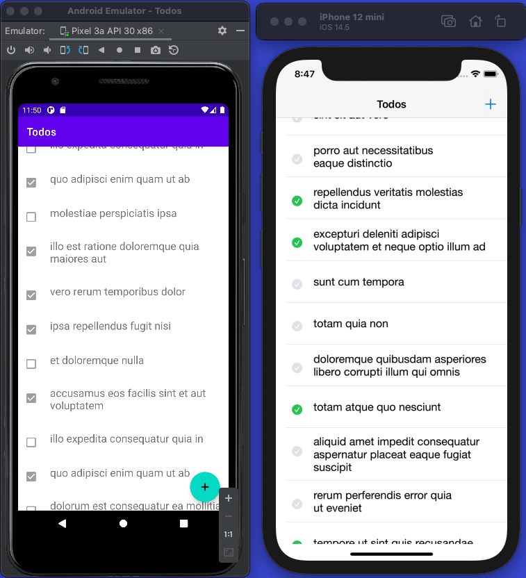
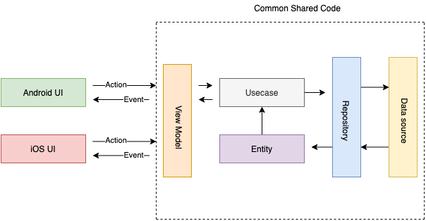

# KMM-TODOS
Sample Todos app using Kotlin Multiplatform

[](./assets/demo-video.mov)

## Flow
<p align="center">
  
</p>

#### Plugins
- Moko-MVVM for ViewModels
- Ktor-Client for making HTTP Calls
- Ktor-Logging for logging HTTP Calls

## iOS Framework generation

Inside Android studio terminal and run the following command

```sh
./gradlew debugFatFramework 
```
```sh
./gradlew debugFatFramework 
```
# KMM-Todos